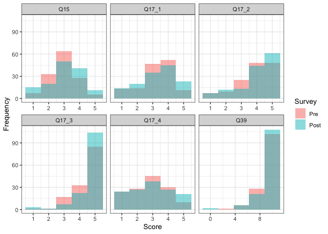

# Data in the Wild–Analyses
Ellen Bledsoe
2025-07-29

This document contains the analyses for the Data in the Wild course.

## Packages and Data

Load the packages used in analyses.

``` r
library(tidyverse)    # for data wrangling
library(lme4)         # for running linear mixed effects models
library(lmerTest)     # for getting p-values from lme4 models
library(broom.mixed)  # for tidy summaries of lme4 models
```

Read in the cleaned dataset.

``` r
data <- read_csv("../data_clean/data_cleaned.csv")

head(data)
```

    # A tibble: 6 × 12
      StudentID Term   Gender Race  School Survey_Type   Q39   Q15 Q17_1 Q17_2 Q17_3
          <dbl> <chr>  <chr>  <chr> <chr>  <chr>       <dbl> <dbl> <dbl> <dbl> <dbl>
    1         1 Fall … Woman  Hisp… Lewis… Pre             7     1     1     1     2
    2         1 Fall … Woman  Hisp… Lewis… Post            4     2     2     2     2
    3         2 Fall … Woman  <NA>  Lewis… Pre             9     4     4     5     1
    4         2 Fall … Woman  <NA>  Lewis… Post           10     4     4     5     5
    5         3 Sprin… Woman  Whit… Unive… Pre            10     3     3     3     5
    6         3 Sprin… Woman  Whit… Unive… Post            9     3     2     5     5
    # ℹ 1 more variable: Q17_4 <dbl>

## Check Distributions

Look at the distribution of responses by question.

``` r
data %>% 
  # reshape the data for plotting
  pivot_longer(starts_with("Q"), 
               names_to = "Question", 
               values_to = "Value") %>% 
  # reorder "pre" and "post" for plotting
  mutate(Survey_Type = as_factor(Survey_Type)) %>% 
  # pipe into a histogram
  ggplot(aes(Value)) +
  geom_histogram(aes(fill = Survey_Type), 
                 position = "identity", alpha = 0.5, bins = 5) +
  facet_wrap(~ Question, scales = "free_x") +
  labs(x = "Score",
       y = "Frequency",
       fill = "Survey") +
  theme_bw()
```



## Run Linear Mixed Effects Models

We want to know if the answers to each question have changed
significantly from pre- to post-survey.

I’m using a linear mixed effects model to include the student’s
identity, the university where the course was taught, and the semester
in which the course was taught as random effects.

### Question 39

Run a model for Q39 responses as a function of the survey (pre
vs. post). Include student, semester, and university as random effects.

``` r
model_Q39 <- lmer(Q39 ~ Survey_Type + (1 | Term) + (1 | School) + (1 | StudentID), 
              data = data)
```

    boundary (singular) fit: see help('isSingular')

``` r
(output_Q39 <- tidy(model_Q39))
```

    # A tibble: 6 × 8
      effect   group     term            estimate std.error statistic     df p.value
      <chr>    <chr>     <chr>              <dbl>     <dbl>     <dbl>  <dbl>   <dbl>
    1 fixed    <NA>      (Intercept)       9.11       0.364    25.0     1.08  0.0199
    2 fixed    <NA>      Survey_TypePre   -0.0949     0.143    -0.665 136.    0.507 
    3 ran_pars StudentID sd__(Intercept)   0.819     NA        NA      NA    NA     
    4 ran_pars Term      sd__(Intercept)   0         NA        NA      NA    NA     
    5 ran_pars School    sd__(Intercept)   0.485     NA        NA      NA    NA     
    6 ran_pars Residual  sd__Observation   1.18      NA        NA      NA    NA     

Semester (`Term`) has a variance of 0, which is causing singularity.
Let’s remove that random effect.

``` r
model_Q39 <- lmer(Q39 ~ Survey_Type + (1 | School) + (1 | StudentID), 
              data = data)
(output_Q39 <- tidy(model_Q39))
```

    # A tibble: 5 × 8
      effect   group     term            estimate std.error statistic     df p.value
      <chr>    <chr>     <chr>              <dbl>     <dbl>     <dbl>  <dbl>   <dbl>
    1 fixed    <NA>      (Intercept)       9.11       0.364    25.0     1.08  0.0199
    2 fixed    <NA>      Survey_TypePre   -0.0949     0.143    -0.665 136.    0.507 
    3 ran_pars StudentID sd__(Intercept)   0.819     NA        NA      NA    NA     
    4 ran_pars School    sd__(Intercept)   0.485     NA        NA      NA    NA     
    5 ran_pars Residual  sd__Observation   1.18      NA        NA      NA    NA     

This removes warning about singularity, which is great.

> **NOTE:** The p-value is 0.51, meaning no significant difference.

Let’s check the model performance. Q39 answers do not have a normal
distribution.

Residuals aren’t great, but aren’t horrible, either?

Out of curiosity, what happens when we include the school as a fixed
effect? We actually have reason to believe this might make more
sense–one class was more computationally focused while another class was
more statistically focused

``` r
model_Q39 <- lmer(Q39 ~ Survey_Type + School + (1 | StudentID), 
              data = data)
broom.mixed::tidy(model_Q39)
```

    # A tibble: 5 × 8
      effect   group     term          estimate std.error statistic    df    p.value
      <chr>    <chr>     <chr>            <dbl>     <dbl>     <dbl> <dbl>      <dbl>
    1 fixed    <NA>      (Intercept)     8.75       0.163    53.8    196.  2.97e-119
    2 fixed    <NA>      Survey_TypeP…  -0.0949     0.143    -0.665  136.  5.07e-  1
    3 fixed    <NA>      SchoolUniver…   0.715      0.200     3.57   135.  5.01e-  4
    4 ran_pars StudentID sd__(Interce…   0.819     NA        NA       NA  NA        
    5 ran_pars Residual  sd__Observat…   1.18      NA        NA       NA  NA        

This does not change out qualitative result at all.

However, it does indicate that the institution at which the course was
taught does have an impact on the scores. I’m not sure if this is worth
investigating, though it does make some sense. The two schools have
quite different student bodies, and the courses had slightly different
flavors–one was more stats-heavy and the other more
computationally-focused.

### Question 15

Let’s run the analysis with Question 15. For every question, the
variance of semester ends up being 0, so I will preemptively remove it.

``` r
model_Q15 <- lmer(Q15 ~ Survey_Type + (1 | StudentID) + (1 | School), 
                  data = data)
(output_Q15 <- tidy(model_Q15))
```

    # A tibble: 5 × 8
      effect   group     term            estimate std.error statistic     df p.value
      <chr>    <chr>     <chr>              <dbl>     <dbl>     <dbl>  <dbl>   <dbl>
    1 fixed    <NA>      (Intercept)        3.08     0.289      10.7    1.06  0.0526
    2 fixed    <NA>      Survey_TypePre    -0.161    0.0957     -1.68 136.    0.0955
    3 ran_pars StudentID sd__(Intercept)    0.545   NA          NA     NA    NA     
    4 ran_pars School    sd__(Intercept)    0.392   NA          NA     NA    NA     
    5 ran_pars Residual  sd__Observation    0.792   NA          NA     NA    NA     

Check the residuals

> **NOTE:** The p-value is 0.1, meaning no significant difference.

### Question 17_1

Let’s run the analysis with Question 17_1.

``` r
model_Q17_1 <- lmer(Q17_1 ~ Survey_Type + (1 | StudentID) + (1 | School), 
                  data = data)
(output_Q17_1 <- tidy(model_Q17_1))
```

    # A tibble: 5 × 8
      effect   group     term            estimate std.error statistic     df p.value
      <chr>    <chr>     <chr>              <dbl>     <dbl>     <dbl>  <dbl>   <dbl>
    1 fixed    <NA>      (Intercept)       3.29      0.341      9.67    1.04  0.0601
    2 fixed    <NA>      Survey_TypePre   -0.0657    0.0979    -0.671 136.    0.503 
    3 ran_pars StudentID sd__(Intercept)   0.731    NA         NA      NA    NA     
    4 ran_pars School    sd__(Intercept)   0.463    NA         NA      NA    NA     
    5 ran_pars Residual  sd__Observation   0.810    NA         NA      NA    NA     

Check the residuals

> **NOTE:** The p-value is 0.5, meaning no significant difference.

### Question 17_2

``` r
model_Q17_2 <- lmer(Q17_2 ~ Survey_Type + (1 | StudentID) + (1 | School), 
                  data = data)
(output_Q17_2 <- tidy(model_Q17_2))
```

    # A tibble: 5 × 8
      effect   group     term            estimate std.error statistic     df p.value
      <chr>    <chr>     <chr>              <dbl>     <dbl>     <dbl>  <dbl>   <dbl>
    1 fixed    <NA>      (Intercept)        4.00      0.392     10.2    1.04  0.0576
    2 fixed    <NA>      Survey_TypePre    -0.139     0.104     -1.33 136.    0.185 
    3 ran_pars StudentID sd__(Intercept)    0.645    NA         NA     NA    NA     
    4 ran_pars School    sd__(Intercept)    0.538    NA         NA     NA    NA     
    5 ran_pars Residual  sd__Observation    0.863    NA         NA     NA    NA     

Check the residuals

> **NOTE:** The p-value is 0.19, meaning no significant difference.

### Question 17_3

Let’s run the analysis with Question 17_3.

This is the question about the importance of data science in
conservation.

``` r
model_Q17_3 <- lmer(Q17_3 ~ Survey_Type + (1 | StudentID) + (1 | School), 
                  data = data)
(output_Q17_3 <- tidy(model_Q17_3))
```

    # A tibble: 5 × 8
      effect   group     term           estimate std.error statistic     df  p.value
      <chr>    <chr>     <chr>             <dbl>     <dbl>     <dbl>  <dbl>    <dbl>
    1 fixed    <NA>      (Intercept)       4.62     0.128      36.2    1.21  0.00862
    2 fixed    <NA>      Survey_TypePre   -0.168    0.0779     -2.15 136.    0.0330 
    3 ran_pars StudentID sd__(Intercep…    0.461   NA          NA     NA    NA      
    4 ran_pars School    sd__(Intercep…    0.153   NA          NA     NA    NA      
    5 ran_pars Residual  sd__Observati…    0.645   NA          NA     NA    NA      

Check the residuals

> **NOTE:** The p-value is 0.03, which is our only significant result.

### Question 17_4

Let’s run the analysis with Question 17_4.

``` r
model_Q17_4 <- lmer(Q17_4 ~ Survey_Type + (1 | StudentID) + (1 | School), 
                  data = data)
(output_Q17_4 <- tidy(model_Q17_4))
```

    # A tibble: 5 × 8
      effect   group     term            estimate std.error statistic     df p.value
      <chr>    <chr>     <chr>              <dbl>     <dbl>     <dbl>  <dbl>   <dbl>
    1 fixed    <NA>      (Intercept)        2.94      0.243     12.1    1.14  0.0379
    2 fixed    <NA>      Survey_TypePre    -0.146     0.124     -1.18 136.    0.242 
    3 ran_pars StudentID sd__(Intercept)    0.671    NA         NA     NA    NA     
    4 ran_pars School    sd__(Intercept)    0.310    NA         NA     NA    NA     
    5 ran_pars Residual  sd__Observation    1.03     NA         NA     NA    NA     

Check the residuals

> **NOTE:** The p-value is 0.24, meaning no significant difference.

## Results

First, bring all of the results together.

``` r
results <- list_rbind(mget(ls(pattern = "output_*")), names_to = "id") |> 
  filter(term == "Survey_TypePre") |> 
  mutate(id = str_extract(id, "Q.*")) |> 
  select(id, term:p.value)
```

Now correct for multiple statistical tests.

``` r
results <- results |> 
  mutate(p.adjust = p.adjust(p.value, method = "BH"))
```

With the correction for multiple tests, no p-values are considered
significant.

``` r
results |> 
  select(id, p.value, p.adjust)
```

    # A tibble: 6 × 3
      id    p.value p.adjust
      <chr>   <dbl>    <dbl>
    1 Q15    0.0955    0.286
    2 Q17_1  0.503     0.507
    3 Q17_2  0.185     0.362
    4 Q17_3  0.0330    0.198
    5 Q17_4  0.242     0.362
    6 Q39    0.507     0.507
