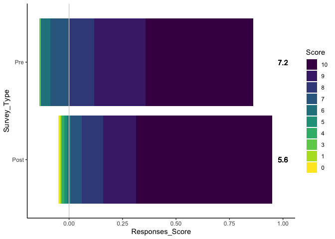
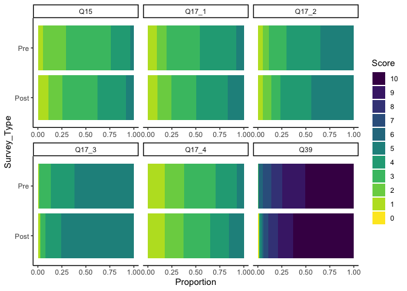

# Data in the Wild–Visualization
Ellen Bledsoe
2025-07-29

This document produces data visualizations for the pre- and post-survey
data set.

## Packages and Data

First, we load the packages that we will need.

``` r
library(tidyverse)  # for data wrangling and plotting
library(ggstats)    # for plotting Likert data with ggplot2
```

We also need the cleaned dataset.

``` r
data <- read_csv("../data_clean/data_cleaned.csv")

head(data)
```

    # A tibble: 6 × 12
      StudentID Term   Gender Race  School Survey_Type   Q39   Q15 Q17_1 Q17_2 Q17_3
          <dbl> <chr>  <chr>  <chr> <chr>  <chr>       <dbl> <dbl> <dbl> <dbl> <dbl>
    1         1 Fall … Woman  Hisp… Lewis… Pre             7     1     1     1     2
    2         1 Fall … Woman  Hisp… Lewis… Post            4     2     2     2     2
    3         2 Fall … Woman  <NA>  Lewis… Pre             9     4     4     5     1
    4         2 Fall … Woman  <NA>  Lewis… Post           10     4     4     5     5
    5         3 Sprin… Woman  Whit… Unive… Pre            10     3     3     3     5
    6         3 Sprin… Woman  Whit… Unive… Post            9     3     2     5     5
    # ℹ 1 more variable: Q17_4 <dbl>

## Pre- and Post-Survey Comparisons

We want to make plots that shown the distributions of the answers pre-
and post-survey.

First, we have to wrangle the data so that there is a column with the
question numbers (for faceting) and calculate proportions for each
score.

``` r
data_long <- data |> 
  # create one column with all of the questions and one column with scores
  pivot_longer(starts_with("Q"),
               names_to = "Question",
               values_to = "Score") |> 
  # convert survey type into a factor
  mutate(Survey_Type = factor(Survey_Type, levels = c("Post", "Pre"))) |> 
  # group by question to get proportions and means
  group_by(Question, Survey_Type, Score) |>
  # how many responses with this score
  summarise(Responses_Score = n()) |>
  # how many responses per question/survey type and calculate proportion
  mutate(Responses_Question = sum(Responses_Score),
         Proportion = Responses_Score / Responses_Question,
         Avg_Score = mean(Score),
         Score = factor(Score, levels = c(10:0))) |>
  ungroup()
```

    `summarise()` has grouped output by 'Question', 'Survey_Type'. You can override
    using the `.groups` argument.

Because Question 39 is on a different scale, we will need to plot it
separately.

``` r
data_long |> 
  filter(Question == "Q39") |> 
  ggplot(aes(x = Responses_Score,
             y = Survey_Type,
             fill = Score)) +
  geom_bar(stat = "identity", position = "likert") +
  geom_vline(aes(xintercept = 0), color = "lightgray") +
  geom_text(aes(x = 1, label = round(Avg_Score, 1))) +
  scale_fill_viridis_d(direction = 1) +
  theme_classic()
```



``` r
ggplot(data_long, aes(x = Proportion,
                      y = Survey_Type,
                      fill = Score)) +
  geom_bar(stat = "identity") +
  scale_fill_viridis_d(direction = 1) +
  facet_wrap(~ Question, scales = "free_x") +
  theme_classic()
```



## Positive vs. Negative Shifts
